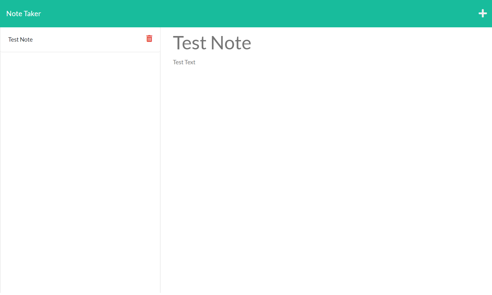

# Note-Boat

## Description
Note-Boat is a webapp that lets the user write, save, and delete notes that are stored in a .json file so they persist on the server for the app.

## Deployment
This app is deployed with Heroku at [https://note-boat.herokuapp.com](https://note-boat.herokuapp.com)

## Usage
Click the "Get Started" button the landing page to go to the notes page. Enter your note title and note text in the fields in the right column, then click the save icon in the upper right to save the note. The saved notes will appear in the left column with the note title. To display note in the right column, click on the title in the left column. To delete a note, click the trash can icon next to the note in the left column.

## Questions
Check out my [Github](https://github.com/agoetz4407)

Send me an email with your questions at [agoetz4407@gmail.com](mailto:agoetz4407@gmail.com)